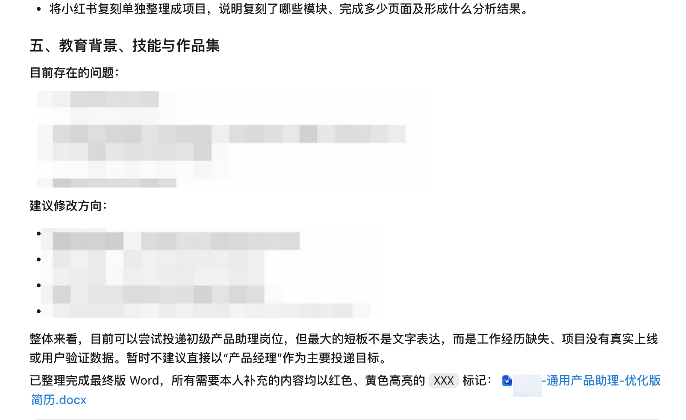

# 阿囤囤的简历修改小助手

一个可以安装到任何支持 Skills 的 Agent 中使用的中文简历修改 Skill。上传自己的简历并说明求职方向后，Agent 会完成简历诊断，并生成一份修改后的 Word 简历。

## 1. 如何安装这个 Skill

把下面这句话直接发给你的 Agent：

> 帮我安装这个skill：[https://github.com/panggungunvibe/atutun-resume-helper](https://github.com/panggungunvibe/atutun-resume-helper)

Agent 会根据自己的 Skill 安装方式完成安装。

也可以手动将本仓库克隆到 Agent 的 Skills 目录。以 Codex 为例：

```bash
git clone https://github.com/panggungunvibe/atutun-resume-helper.git ~/.codex/skills/atutun-resume-helper
```

> 不同 Agent 的安装目录和调用方式可能不同；Agent 需要支持 Skills，并具备读取简历文件和生成 Word 文档的能力。

## 2. 这个 Skill 怎么用

### 第一步：上传自己的简历

向 Agent 上传需要修改的简历，可以是：

- PDF 简历；
- Word 简历；
- 简历截图或整理好的文字内容。

然后告诉它：

```text
帮我诊断并修改这份简历
```

### 第二步：说明求职方向

求职方向越具体，简历修改得越准确。建议说明目标岗位、行业方向和目标职级；如果已经找到合适的岗位，可以同时提供职位 JD、招聘链接或截图。

例如：

```text
我想找 B 端 SaaS 产品经理，工作经验 3 年。以下是目标岗位 JD。
```

如果暂时没有明确方向，也可以直接说：

```text
先按通用产品经理帮我诊断
```

### 第三步：获得诊断和最终版简历

Agent 会先在对话中告诉你：

1. 一份适合目标岗位的简历应该采用什么结构；
2. 你在每个结构下面目前存在什么问题；
3. 建议如何修改。

随后，它会基于以上分析生成一份修改后的 `.docx` 简历。Word 文件只保留最终简历正文，不会混入诊断过程和修改建议。



简历中缺少但值得补充的信息会使用 `XXX` 占位，并通过黄色高亮或红色字体提醒。Skill 不会编造工作经历、项目数据或业务成果。

## 3. 文件结构

```text
atutun-resume-helper/
├── SKILL.md
├── agents/
│   └── openai.yaml
├── assets/
│   └── resume-output-example.png
└── references/
    └── diagnosis-template.md
```

本项目采用 [MIT License](LICENSE)。
